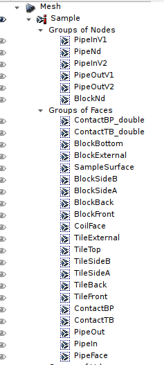
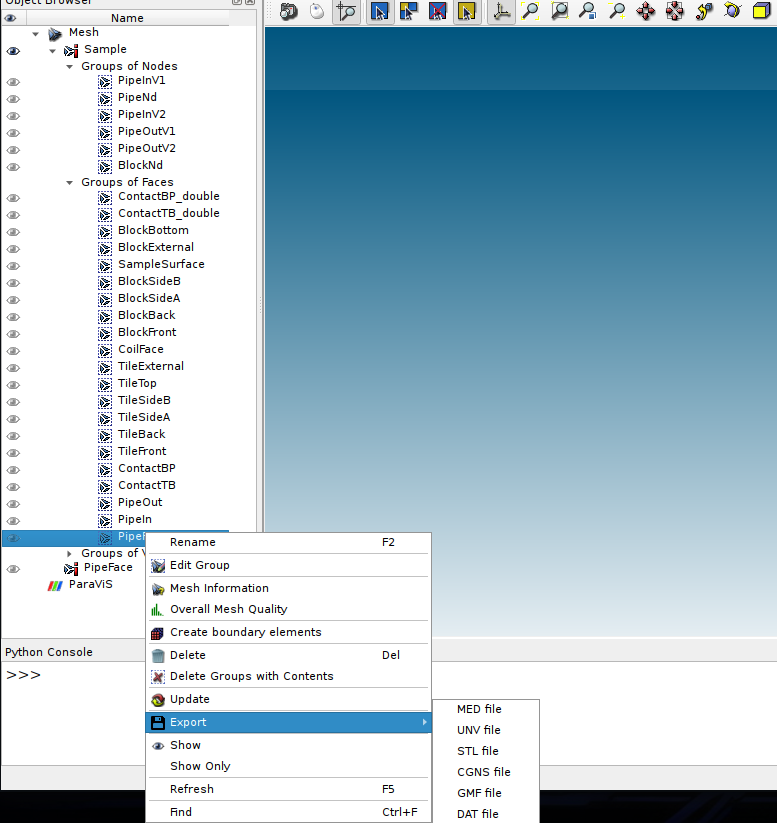
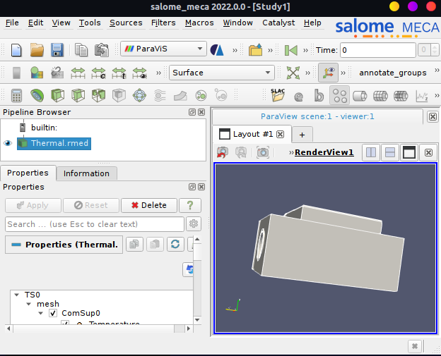
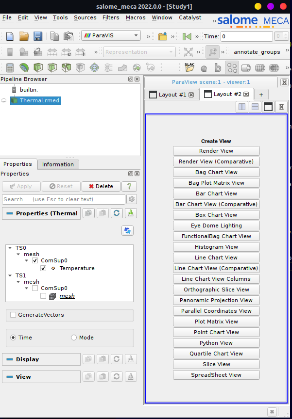
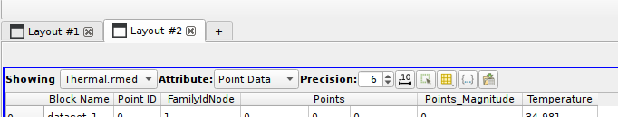
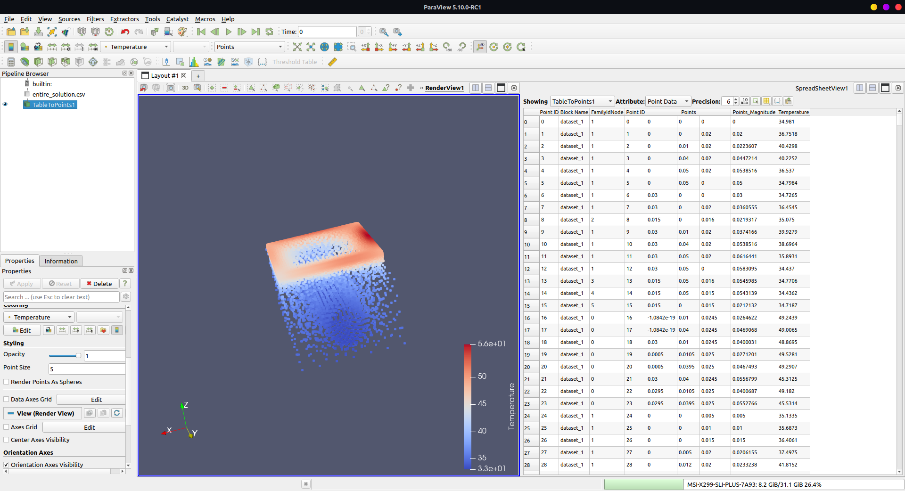

## Extract BC coordinates (csv file)
The med file is located at : 
```sh
/scratch/s.1915438/vltesting/VirtualLab/Output/HIVE/Tutorials/Meshes
```

It is named as AMAZE.med.

Open salome: 

```sh
singularity run --nv salome_meca-lgpl-2022.1.0-1-20221225-scibian-9.sif
```

If it gives glibc error, then remove the `--nv` flag to run on iGPU.

In Salome go to mesh mode. In file go to import and choose `MED file`.

Now we will see each part of the mesh. 


And we can export any group using by simply using the context menu and choosing `Export`.



Here we choose `.csv` because it is easy to add in numpy arrays.

We need to supply to `.comm` file to chatgpt for the surface for the BCs.

# Extracting the solution
The results are stored in `Thermal.rmed` at 

```sh
/scratch/s.1915438/vltesting/VirtualLab/Output/HIVE/Tutorials/Examples/HIVE_Coil/Aster
```

Click on the + next to "Layout #1" to open a new tab.


Click on the last option "SpreadSheet view" to open the results in a table.


Make sure, you can see point i.e. nodal coordinates and the corresponding temperature. Click on the last icon with a green colour downward arrow, to export the csv.




# Tree
─> tree

├── BC_coordinate_search.py
├── BC nodal coordinates
│   ├── individual csv file
│   │   ├── PipeFace.csv
│   │   └── TileTop.csv
├── entire_solution.csv


# Verify the csv file
1. Open the CSV File: Use File > Open in ParaView to load your CSV file. Initially, it will appear as a spreadsheet.

2. Convert to Point Cloud: Apply the Table To Points filter (found under Filters > Alphabetical) to convert the table into a point cloud. Map the CSV columns to spatial coordinates (X, Y, Z) by selecting the appropriate columns for Points_0, Points_1, and Points_2.

3. Adjust Visualization: Click Apply to visualize the point cloud in the 3D view. Customize the point size and color mapping (e.g., based on Temperature) via the Properties panel to enhance the visualization. Set point_size to see bigger points.



# Extracting AMAZE geometry and mesh
Mesh can be extracted med file as showed earlier.

The `output/HIVE/Tutorials/Meshes` contains the a `xao` file. And this is the geometry file which we need for ANSYS, COMSOL etc. I had no idea this is geometry file and I spent 1 week going crazy about it.

We can export `step` file from this `xao` file. We need to open this xao file in Salome as geometry and then export it as step file. Remember geometry not mesh.